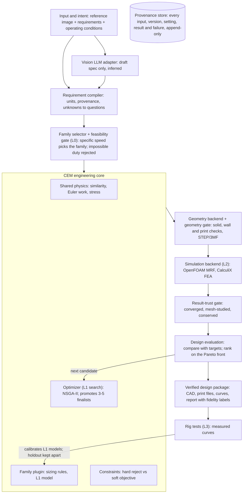
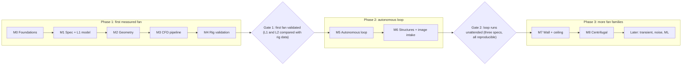

# Fan CEM (any fan family) — Production-Grade Architecture & Implementation Plan

As of 9 October 2026

> **Status (9 October 2026): partly superseded.** The Fan CEM Requirements Specification v1 (`docs/requirements.md`) and `docs/build-plan.md` replace the Python-first stack in this plan: section 1 item 4, the language and units rows and the C# paragraph in section 3, the repository structure and Python interfaces in section 8, the first-week plan in section 11, and the ADR-001 recommendation in section 12. The OpenFOAM version is now v2512, not v2606 (ADR-006: v2606's apt packages are release-candidate only); wherever this plan says v2606, read v2512. The current decision is a C++23 kernel with Python orchestration (Requirements Specification, section 3). Still authoritative: the engineering content in sections 2, 4, 5, 6, 7, 9 and 10, and the definitions of ADR-002 (v1 scope and validation target) and ADR-003 (requirement semantics) in section 12.

## Scope and operating assumptions

The CEM designs any common fan family from a reference image plus requirements. The image sets product intent (type, look, mounting); the duty point and physics decide the aerodynamic family. When they disagree, the CEM reports the conflict instead of forcing the image's type.

Target machine: Intel i5 12th gen (LOQ, about 4 performance + 4 efficiency cores), 16 GB RAM, RTX 3050 6 GB. Consequence: analytical models do the searching, and CFD only verifies a handful of finalists, one run at a time.

**Fan families and when each is supported**

| Family | Typical products | Support level | Why this order |
| --- | --- | --- | --- |
| Ducted axial (tube-axial) | PC/cabinet fans, inline duct fans | v1: full loop (design, CFD, print, test) | Best-understood theory, small, printable, cheap test rig |
| Unducted propeller axial | Wall, pedestal, table, exhaust fans | v2 | Same blade theory; adds tip-vortex and installation effects |
| Ceiling fan | Ceiling fans, 900–1400 mm sweep | v2–v3 | Low speed, large rotor, rated by air delivery in a test room; needs room-scale CFD and the standard's test method |
| Centrifugal (backward- or forward-curved) | Blowers, range hoods, purifiers | v3 | Different design method (slip, volute) |
| Mixed-flow | Inline boosters, compact high-pressure fans | v4 | Needs meridional design; builds on axial + centrifugal |
| Cross-flow (tangential) | AC indoor units, tower fans | Research | Vortex-dominated flow; no reliable analytical model |
| Bladeless (air-multiplier type) | Bladeless desk/tower fans | Research | Hidden impeller + Coanda ring + entrainment |

**What "production grade" means in this project**

| Property | Concrete requirement |
| --- | --- |
| Reproducible | Every run pins git commit, container image digest, solver versions and an input hash. Analytical results rerun bit-identical; CFD within solver tolerance |
| Traceable | Every number in a report links to the model or simulation that produced it and its fidelity level |
| Honest | Each result carries a label: predicted (analytical), simulated (CFD/FEA), verified (simulated + mesh and convergence evidence), validated (measured on a rig) |
| Tested | Unit, property, regression and numerical benchmark tests run in CI on every change |
| Bounded | Hard limits on wall time, cores, RAM, disk and retries per run and per campaign |
| Recoverable | Job state survives crashes and power loss; a campaign resumes where it stopped |
| Extensible | A new fan family is a new plugin; the core does not change |

## 1. Executive recommendation

Build one family-agnostic CEM core in typed Python, add one plugin per fan family, and ship the ducted axial plugin first as a complete, physically measured vertical slice. Your proposed flow is right in shape; section 4 adds the five pieces it needs to be production grade.

The decisions, in order of consequence:

1. **Physics picks the fan family, not the image.** The image proposes a product type (ceiling, pedestal, blower). The duty point (flow, pressure, speed) is checked against specific-speed ranges. If an axial fan cannot meet the duty, the CEM says so and proposes the family that can.
2. **A fidelity ladder controls cost.** L0 similarity and feasibility (microseconds), L1 family-specific analytical models (milliseconds), L2 RANS CFD and FEA (hours), L3 rig measurement (days). The optimizer searches at L1; only finalists climb.
3. **Every result carries its fidelity label.** Reports separate predicted, simulated, verified and validated numbers. Nothing is called validated without a rig measurement.
4. **Python-first stack:** build123d on OpenCascade for geometry, Gmsh for FEA meshes, OpenFOAM v2512 (ESI) for CFD, CalculiX for structures, pymoo for Pareto search, SQLite plus a content-addressed file store for provenance. Section 3 explains why not C#-first. *(Superseded: see the status note.)*
5. **The LLM stays outside the numerical core.** A cloud vision model turns the image and text into a draft specification marked as inferred. A deterministic compiler validates it, and the user confirms anything essential.
6. **Your laptop sets the CFD budget.** With 16 GB RAM, plan on one periodic single-passage RANS case at a time, roughly 0.5–2 million cells. Treat this as an assumption to measure in week 1.
7. **The first demonstrable result** is a 120 mm ducted axial fan, designed from a requirement, exported as STEP and 3MF, verified by one CFD run with a mesh study, printed, and measured on a simple rig.

What not to build yet: a custom geometry kernel, a neural surrogate, transient sliding-mesh CFD, acoustic prediction, and the cross-flow and bladeless families.

## 2. Critical assessment of feasibility and risks

An autonomous loop for ducted and unducted axial fans is feasible in months on your hardware; "any fan from any image" is a multi-year program because three families still lack reliable fast models. The biggest risk is not software but trust: analytical models and coarse CFD can disagree with reality by large margins until calibrated against measurements.

**Four different claims a design can make**

| Level | What it proves | What it does not prove |
| --- | --- | --- |
| CAD model | The geometry is valid, closed, printable and fits the envelope | Anything about airflow, pressure or efficiency |
| Predicted (L0–L1) | The design is plausible under stated model assumptions | Accuracy outside the model's validity range |
| Simulated and verified (L2) | The RANS equations were solved correctly on this geometry: converged, mesh-independent, conservative | That RANS physics matches the real fan (stall, transition, tip vortex) |
| Validated (L3) | Measured performance on a rig matches prediction within a stated uncertainty | Performance under conditions not tested |

**What the image can and cannot give**

| Can infer (with stated confidence) | Cannot infer |
| --- | --- |
| Product type: ceiling, pedestal, wall, exhaust, inline, blower, cross-flow, bladeless | Absolute size, unless a known reference object or dimension is given |
| Blade count, if blades are visible | Blade pitch, twist and camber; a photo projects 3D angles ambiguously |
| Rough proportions: hub-to-tip ratio, duct presence, guard style | Internal geometry: centrifugal impellers, bladeless-fan impellers, motors |
| Mounting and style intent | Materials, speed, airflow or any performance number |

**Feasible now vs too ambitious**

| Item | Verdict | Reason |
| --- | --- | --- |
| Ducted axial: design, CFD, print, test | Feasible in v1 | Classical theory, small domain, cheap rig |
| Unducted axial and ceiling fans | Feasible in v2–v3 | Same blade theory; installation and room effects need calibration |
| Centrifugal blowers | Feasible in v3 | Well-documented meanline methods; volute adds geometry work |
| Cross-flow and bladeless | Research | Flow is dominated by vortices and entrainment; no trustworthy fast model |
| Noise in dB(A) | Research at your compute level | Needs transient CFD plus acoustic analogy, or measured data |
| Reconstructing exact geometry from a photo | Not a goal | Physically underdetermined |

**Research problems vs ordinary engineering**

- Ordinary engineering: requirement compiler, unit system, plugin framework, parametric CAD, case templating, job runner, provenance store, reports, CI.
- Applied engineering with known methods: blade-element and meanline models, CFD setup, mesh studies, FEA of blades, rig testing to ISO 5801 or AMCA 210 principles.
- Research: cross-flow and bladeless models, noise prediction, image-to-geometry beyond proportions, surrogates that generalize across families.

**Top risks and mitigations**

| Risk | Impact | Mitigation |
| --- | --- | --- |
| Analytical model error at off-design or low Reynolds number | Optimizer exploits model error | Validity ranges enforced in code; finalists always verified at L2; calibrate on measured fans |
| CFD memory exceeds 16 GB | Crashes, swap thrash | Periodic single passage; cell-count guard before meshing; memory limit per job |
| Automated meshing fails on unusual geometry | Silent bad results | Mesh-quality gates (non-orthogonality, skewness, y+); failed meshes are recorded, never scored |
| Unconverged CFD treated as success | False optimum | Trust gate checks residuals, mass balance and monitor stability before any ranking |
| 3D-printed parts differ from CAD | Test does not match design | Measure printed blades; record as-built deviations; tolerances in spec |
| Scope creep to all families | Nothing works end to end | Family plugins gated by roadmap; one family must pass L3 before the next starts |

**Assumptions to test before committing**

1. OpenFOAM single-passage MRF fits in 16 GB at a mesh fine enough to pass a three-level mesh study.
2. The geometry kernel can loft twisted, cambered blades and fillet the root reliably across the full parameter range.
3. The L1 axial model ranks candidates in the same order as L2 CFD for at least most of a 10-design sample.
4. A home-built rig reproduces a commercial fan's published curve closely enough to be useful (agree the tolerance before testing).
5. A vision model classifies fan type and blade count correctly on your own photo set (measure accuracy, do not assume it).

## 3. Recommended technology stack and alternatives

*(The language and units rows and the C# paragraph are superseded: see the status note and Requirements Specification section 3. The other rows stand.)*

| Layer | Primary choice | Alternatives considered | Why this one | Migration cost later |
| --- | --- | --- | --- | --- |
| Language and runtime | C++23 kernel + Python 3.13+ orchestration (see Requirements Specification, ADR-001) | C#/.NET, Rust, Julia, Python only | See Requirements Specification section 3 | High for the kernel; stable C ABI limits it |
| Units | mp-units in the kernel; unit conversion only in the spec compiler | pint, custom unit types | Dimensional errors fail at compile time | Low |
| Numerics | NumPy, SciPy in Python orchestration and reference code | Hand-written solvers | Tested, fast enough | Low |
| Parametric CAD | OpenCascade (OCCT) 8.0 through its C++ API | build123d, CadQuery, FreeCAD scripting, PicoGK/ShapeKernel | Exact B-rep lofts for twisted blades; STEP export | Medium; isolate behind a GeometryBackend interface |
| Voxel/implicit geometry | Deferred; PicoGK only if lattices or heavy fillets are needed | OpenVDB directly | Voxel memory grows fast at fine resolution on 16 GB; fans do not need it in v1 | Low, because it is an added backend |
| CFD | OpenFOAM v2512 (ESI/Keysight; see ADR-006), simpleFoam with MRF, rotorDisk source for room-scale ceiling fans | OpenFOAM Foundation v13, SU2, commercial (Ansys, Star-CCM+) | Mature MRF and cyclic/AMI support, snappyHexMesh, GPL, scriptable | Medium; the case template layer isolates it |
| CFD meshing | snappyHexMesh (hex-dominant, layers) | cfMesh, Gmsh volume mesh | Native to OpenFOAM, robust for rotating zones | Medium |
| FEA meshing | Gmsh 4.15 (OCC kernel) | Netgen, Salome | Reads STEP directly; second-order tetrahedra for CalculiX | Low |
| Structural FEA | CalculiX (ccx) | Code_Aster, FEniCSx | Small, scriptable, Abaqus-like input, centrifugal loads built in | Low to medium |
| Optimization | pymoo 0.6.1 (NSGA-II/NSGA-III), SciPy for single-objective | Optuna, BoTorch, Dakota | Constrained multi-objective out of the box; reproducible seeds | Low; optimizer sits behind an interface |
| Image and text interpretation | Cloud vision LLM with JSON-schema structured output | Local Qwen-VL class model at 4-bit on the RTX 3050 | Better accuracy than what fits in 6 GB VRAM; it never touches numerics | Low; one adapter |
| Storage and provenance | SQLite (WAL mode) + content-addressed artifact store on disk | PostgreSQL, MLflow, DVC | Zero-ops, transactional, enough for one machine | Low; schema migrates to PostgreSQL |
| Job orchestration | In-house durable job queue on SQLite, one worker per resource class | Prefect, Celery, Ray | Small, crash-safe, no server; heavy jobs run strictly one at a time | Medium if moving to a cluster |
| Containers | Docker (dev), Apptainer (if a cluster comes later) | Native installs | Pins OpenFOAM, CalculiX, Gmsh and OCCT together | Low |
| Testing | Catch2 (C++), pytest, Hypothesis (property tests), numerical benchmark suite | — | Property tests catch unit and range errors in physics code | Low |
| CI and quality | GitHub Actions (or GitLab CI), clang-tidy, sanitizers, ruff, mypy --strict | — | Every change runs fast tests; nightly runs CFD benchmarks | Low |
| Visualization and reports | ParaView/pvpython, matplotlib, Jinja2 to HTML/PDF | — | Scriptable, reproducible figures | Low |

**Operating system.** Install Ubuntu 24.04 natively (dual boot). If you stay on Windows, WSL2 works, but it gets only half the RAM by default; raise it in .wslconfig and expect some file-system overhead.

## 4. Architecture and component responsibilities

Your flow (input, requirement compiler, CEM core, geometry, simulation, evaluation loop, design package) is the right backbone, and "engineering code decides feasibility" is the right rule. It needs five additions to handle any fan type and to be trustworthy: a family selector, a feasibility gate, a fidelity ladder, a result-trust gate separate from scoring, and a physical-test loop that calibrates the models.



Only candidates that pass the result-trust gate reach evaluation; rig measurements calibrate the L1 models, with holdout fans kept apart. The provenance store records every step.

**Review of your proposed flow**

| Your block | Verdict | Change |
| --- | --- | --- |
| Input and intent | Keep | Add operating environment (air temperature, altitude, installation) and an explicit user confirmation step |
| Requirement compiler | Keep, strengthen | Every field carries value, unit, uncertainty and provenance (user, image-inferred, default, unknown). Essential unknowns block the run or become documented assumptions |
| Family selector | Missing: add | Classifies the image's product type, then checks it against the duty point using specific speed and diameter. Conflicts go back to the user |
| Feasibility gate | Missing: add | Rejects impossible requirements in milliseconds (e.g. pressure beyond what the tip speed can deliver) before any geometry exists |
| Physics, design logic, constraints | Keep, restructure | Physics and constraints are shared core; design logic (sizing rules, parameterization) lives in each family plugin. Constraints split into hard (reject) and soft (objective) |
| Optimizer | Keep, restrict | Searches only with L1 models; promotes a few finalists to L2. Never ranks a failed or untrusted result |
| Geometry backend | Keep | Add a geometry gate: valid closed solid, minimum wall thickness, printability, envelope fit |
| Simulation backend | Keep | Add a result-trust gate: residuals, mass balance, monitor stability, mesh quality, mesh-study status |
| Evaluation and feedback loop | Split in two | "Is this result trustworthy?" and "Is this design good?" are separate questions, answered by separate components |
| Provenance store | Missing: add | Records every candidate, input, version, setting, result and failure; makes runs reproducible |
| Rig test loop | Missing: add | Measured data calibrates L1 models, with a held-out set never used for calibration |
| Verified design package | Keep, relabel | Each number is tagged predicted, simulated, verified or validated |

**Deterministic, probabilistic and external**

| Part | Nature | Rule |
| --- | --- | --- |
| Image and text interpretation (LLM) | Probabilistic | Produces a draft spec only; every field is tagged inferred with a confidence; never feeds physics directly |
| Requirement compiler, family selector, feasibility gate, L0/L1 physics, constraints, geometry builder | Deterministic | Same input and version give bit-identical output; covered by unit and property tests |
| Optimizer | Pseudo-random | Fixed seed recorded per campaign; rerun reproduces the same candidates |
| Meshing, CFD, FEA | External numerical solvers | Deterministic given identical inputs, binaries and core count; results accepted only through the trust gate |
| Rig measurements | Physical, with measurement uncertainty | Recorded with instrument, calibration date and uncertainty estimate |

**How an image becomes a specification**

1. The vision model returns a JSON object matching a fixed schema: product type, blade count, duct present, hub-to-tip ratio estimate, mounting, each with a confidence.
2. The compiler merges it with the user's text and defaults. User statements override image inferences; inferences override defaults.
3. Fields the image cannot provide (diameter, speed, airflow, pressure) stay unknown unless the user states them or a documented default applies (e.g. "1200 mm sweep is the most common ceiling fan size").
4. Essential unknowns trigger questions. In autonomous mode, the run proceeds only with defaults marked provisional, and the report lists them first.
5. The family selector checks the image's type against physics. Example: an image of a pedestal fan with a requirement of 500 Pa at 0.05 m³/s is flagged, because that duty belongs to a centrifugal or mixed-flow machine.

**Core data contracts** (JSON, versioned with a schema_version field)

```json
{
  "schema_version": "1.0",
  "spec_id": "spec_2026-10-09_0001",
  "product_type": {"value": "ducted_axial", "provenance": "user"},
  "diameter_m": {"value": 0.120, "unit": "m", "tolerance": 0.0005, "provenance": "user"},
  "speed_rpm": {"value": 2000, "provenance": "default", "note": "provisional"},
  "duty_point": {"flow_m3s": {"value": 0.020, "provenance": "user"},
                 "static_pressure_pa": {"value": 30, "provenance": "user"}},
  "blade_count": {"value": 7, "provenance": "image", "confidence": 0.8},
  "noise_limit_dba": {"value": null, "provenance": "unknown"},
  "manufacturing": {"process": "fdm", "material": "PETG", "min_wall_m": 0.0008},
  "environment": {"air_density_kgm3": 1.18, "temperature_k": 298.15}
}
```

The values above illustrate the format only; they are not the v1 duty point, which is still unknown.

A candidate references its spec, family, plugin version and parameter vector. An evaluation result references the candidate, the fidelity level, the solver versions, the trust-gate verdict and the metrics with units. Results are append-only: a rerun creates a new record, never overwrites.

## 5. Fan specification and design variables

The specification has a shared core used by every family plus family-specific fields; design variables are owned by each family plugin. Every range below is a starting search bound to review, not a validated limit.

**Shared requirement fields**

| Field | Unit | Essential? | Typical source |
| --- | --- | --- | --- |
| Product type | — | Yes | Image, confirmed by user |
| Size envelope (diameter or box) | m | Yes | User; image only with a known reference dimension |
| Duty point: flow | m³/s | Yes for ducted and centrifugal | User |
| Duty point: pressure rise (static or total, stated which) | Pa | Yes for ducted and centrifugal | User |
| Air delivery and service value | m³/min, m³/min/W | Yes for ceiling fans | User or target standard |
| Speed, or speed range | rpm | Yes, or derived from motor limits | User or default |
| Power or efficiency target | W, — | Recommended | User |
| Noise target | dB(A) at stated distance | Optional; reported as unverified in v1 | User |
| Material and process | — | Yes | User or default |
| Air conditions | kg/m³, K | Default: 1.18 kg/m³, 298 K | Default |
| Safety factor on stress | — | Default 2.0 for printed parts; review | Default |

The compiler rejects a spec when static versus total pressure is not stated, when units are inconsistent, or when an essential field is unknown and no default is allowed.

**Ducted axial design variables (v1)**

| Variable | Symbol | Initial search range | Notes |
| --- | --- | --- | --- |
| Tip diameter | D | Fixed by envelope minus clearance | 120 mm nominal |
| Hub-to-tip ratio | ν | 0.30–0.60 | Higher ratio supports higher pressure |
| Blade count | Z | 3–11 (integer) | Interacts with solidity and noise tones |
| Solidity at hub, mid, tip | σ = cZ/(2πr) | 0.4–1.5 | Three control points, smooth spline |
| Design vortex exponent | n | 0 (free vortex) to 1 (forced) | Sets spanwise work distribution |
| Blade angle offset | Δβ | ±10° | Trims the whole blade |
| Camber profile | — | Circular arc or NACA 65 family | Chosen per plugin version |
| Thickness ratio | t/c | 6–12%, floored by printer minimum wall | |
| Sweep and lean | — | Fixed at zero in v1 | Added in v2 for noise |
| Tip clearance | s/D | 0.5–2.0% | Floored by print and assembly tolerance |
| Root fillet radius | r_f | 1–3 mm | Structural and printability |
| Duct inlet bell radius | r_b/D | 0.05–0.15 | Strong effect on inlet losses |
| Speed | N | Fixed 2000 rpm, or a range if the motor allows | |

**Ceiling fan design variables (v2–v3)**

Sweep diameter (typically 900–1400 mm), blade count (3–5), root and tip chord, taper, root and tip pitch angle, linear or nonlinear twist, camber, blade droop angle, motor hub diameter and speed. Performance targets are air delivery and service value measured to IS 374:2019 in India, or the target market's equivalent standard. Typical speeds are low (a few hundred rpm); confirm with your motor data.

**Centrifugal design variables (v3)**

Inlet and outlet diameters (D₁, D₂), blade inlet and outlet angles (β₁, β₂), blade count, inlet and outlet widths (b₁, b₂), blade shape (backward, radial, forward), volute area schedule and tongue clearance.

**Shared constraints**

| Constraint | Type | Check |
| --- | --- | --- |
| Envelope fit | Hard | Geometry bounding box versus spec |
| Tip speed limit | Hard | U_tip below material and noise limits |
| Minimum wall and feature size | Hard | Thickness field versus process minimum |
| Printability (overhangs, supports) | Hard for FDM | Overhang angle check in chosen print orientation |
| Blade stress | Hard | σ_max × safety factor below allowable (with creep derating for polymers) |
| Natural frequency margin | Hard from v2 | First blade mode away from 1× and blade-pass excitation |
| Diffusion limits | Soft (validity) | de Haller ratio and diffusion factor within model range |
| Model validity range | Hard | Candidate outside an L1 model's range is not scored by that model |

## 6. Physics and simulation strategy

Each family plugin implements the same four-level fidelity ladder; the shared core holds similarity laws, family selection and structural checks. Every model function declares its assumptions and validity range in code and refuses inputs outside it.

| Level | Method | Cost per candidate | Used for |
| --- | --- | --- | --- |
| L0 | Similarity laws, specific speed, tip-speed limits | Microseconds | Family selection, feasibility gate |
| L1 | Family analytical model (blade element, meanline, actuator disk) | Milliseconds | Optimization search |
| L2 | Steady RANS CFD (MRF) + linear FEA | Hours | Verifying 3–5 finalists |
| L3 | Rig measurement | Days | Validation and calibration |

**L0: similarity and family selection (established methods)**

Fan laws for geometrically similar fans at the same Reynolds-number regime:

```latex
Q \propto N D^3, \qquad \Delta p \propto \rho N^2 D^2, \qquad P \propto \rho N^3 D^5
```

Flow and pressure coefficients, with U the tip speed:

```latex
\phi = \frac{Q}{\frac{\pi}{4} D^2 U}, \qquad \psi = \frac{2\,\Delta p_t}{\rho U^2}
```

Specific speed and specific diameter decide which family can meet a duty point efficiently (Cordier diagram):

```latex
\omega_s = \frac{\omega \sqrt{Q}}{(\Delta p_t/\rho)^{3/4}}, \qquad \delta_s = \frac{D\,(\Delta p_t/\rho)^{1/4}}{\sqrt{Q}}
```

Low ω_s points to centrifugal, middle to mixed-flow, high to axial. Encode the boundaries from a published Cordier dataset and test them against known fans; do not hard-code numbers from memory.

**L1: family models**

All rotating families share the Euler work equation and efficiency definition:

```latex
\Delta p_{t,\text{ideal}} = \rho\,(U_2 c_{u2} - U_1 c_{u1}), \qquad \eta_t = \frac{Q\,\Delta p_t}{P_{\text{shaft}}}
```

- **Axial (ducted and unducted):** blade-element model over 10–20 radial stations with velocity triangles, a chosen vortex distribution, cascade lift and drag correlations, and loss models for profile, tip clearance and end walls. Validity checks: de Haller ratio W₂/W₁ above about 0.7 and Lieblein diffusion factor within the correlation's range. Unducted fans add tip-loss correction (Prandtl type).
- **Ceiling fans:** blade-element momentum theory for a low-speed rotor, as for a hovering rotor, with an actuator-disk momentum balance. Ideal induced velocity and power:

```latex
T = 2\rho A v_i^2, \qquad P_{\text{ideal}} = T v_i
```

  Standard air delivery (IS 374 counts air above a velocity threshold within a test room) depends on the room, so it needs L2 room-scale CFD or L3 measurement; L1 only ranks designs.

- **Centrifugal:** meanline model with velocity triangles, Wiesner slip factor and empirical loss correlations for incidence, friction, diffusion and volute:

```latex
\sigma_s = 1 - \frac{\sqrt{\sin\beta_2}}{Z^{0.7}} \quad (\beta_2 \text{ measured from the tangential direction})
```

- **Structures (all families):** centrifugal stress at the blade root, plus aerodynamic bending from the L1 load distribution:

```latex
\sigma_c(r_h) = \frac{\rho_m\,\omega^2}{A(r_h)} \int_{r_h}^{r_t} A(r)\,r\,dr
```

**What needs data or expertise before trusting it**

| Model | Status |
| --- | --- |
| Fan laws, Euler equation, velocity triangles, centrifugal stress | Implement now; textbook methods |
| Cascade lift, drag and deviation correlations | Implement now from literature; calibrate against L2 and L3 |
| Tip-clearance and end-wall loss models | Empirical; needs calibration on your fans |
| Printed-polymer strength, anisotropy and creep | Needs coupon tests for your printer, material and orientation |
| Ceiling-fan air delivery versus room | Needs CFD and test-room data |
| Noise | Ranking proxies only (below) |

**L2: CFD on a 16 GB machine**

| Case | Domain | Method | Planning budget (verify in week 1) |
| --- | --- | --- | --- |
| Ducted axial | One blade passage, cyclic (periodic) sides, upstream and downstream duct | simpleFoam, MRF, k-ω SST | 0.5–2 M cells, 4 MPI ranks on performance cores |
| Unducted axial (wall, pedestal) | One passage of a large cylindrical domain | Same | 1–3 M cells |
| Ceiling fan, design ranking | One passage of a cylindrical room-like domain | MRF with resolved blades | 1–3 M cells |
| Ceiling fan, air delivery estimate | Full test room | rotorDisk source (blade elements, no resolved blades) | Under 3 M cells |
| Centrifugal | Full impeller + volute (volute breaks periodicity) | MRF | Likely above budget; consider cloud or coarse screening only |

Each CFD run computes a pressure-flow curve with 3–5 operating points, not one point. Required outputs: flow, static and total pressure rise, shaft torque and power, total-to-static efficiency. The result-trust gate requires: residuals below thresholds set per case, mass imbalance inlet-to-outlet below 0.5%, torque and pressure monitors flat over the last 20% of iterations, mesh-quality limits met, and y+ consistent with the wall treatment. A three-level mesh study with grid convergence index (GCI) runs on every finalist before its number is labelled verified.

Transient sliding-mesh (AMI) runs, needed for unsteady loads and tonal noise sources, are outside the local budget; rent cloud cores for them when required.

**L2: structures**

CalculiX linear static analysis of one blade plus hub sector with centrifugal and mapped pressure loads, followed by a modal analysis for a Campbell check against 1× and blade-pass frequencies. Gmsh produces second-order tetrahedra from the same STEP file used for printing.

**Noise: what can and cannot be claimed**

Steady RANS does not predict noise. v1 reports only relative proxies: tip speed (broadband sound power rises steeply with it), blade loading and blade-pass frequency, labelled "noise ranking, not a dB prediction". A dB(A) claim requires measurement in a quiet room with a calibrated sound meter, or transient CFD with an acoustic analogy (Ffowcs Williams–Hawkings), which is a later, cloud-scale step.

## 7. Optimization strategy

Run constrained multi-objective search (NSGA-II) at L1, keep the Pareto front, and promote a small, diverse set of finalists to L2; never mix raw quantities with different units into one score. A typical campaign on your laptop is 20,000–100,000 L1 evaluations (minutes) followed by 3–5 L2 verifications (one or two nights).

**Objectives per family** (each a physical quantity, compared on its own axis)

| Family | Objectives | Hard constraints |
| --- | --- | --- |
| Ducted axial | Maximize total-to-static efficiency at the duty point; minimize tip speed (noise proxy); minimize part mass or print time (cost proxy) | Meets duty pressure at duty flow with margin; stall margin; all shared constraints |
| Unducted axial | Maximize flow per watt; minimize tip speed; minimize mass | Flow target at a stated distance; stress; envelope |
| Ceiling fan | Maximize service value; maximize air delivery; minimize blade mass | Minimum air delivery for size class; stress; balance; regulatory safety |
| Centrifugal | Maximize efficiency; minimize outer diameter; minimize tip speed | Duty point; volute fits envelope |

"Meets the duty point" is a constraint, not an objective: a candidate that misses the pressure target is infeasible however efficient it is. Constraint handling uses feasibility-first ranking (feasible candidates always beat infeasible ones; infeasible ones are ranked by total normalized violation).

**Promotion from L1 to L2**

1. Take the feasible L1 Pareto front.
2. Remove candidates within 10% of a model's validity limit, since they are where the model is least reliable.
3. Pick 3–5 points spread along the front (knee point plus extremes), so CFD tests the trade-off, not one corner.
4. Run L2 with a mesh study on the best one or two.
5. If L2 and L1 disagree beyond a set tolerance, record the discrepancy and flag the L1 model for calibration, instead of silently re-ranking.

**Final selection** is the user's choice among verified Pareto points, presented with trade-offs in physical units. In fully autonomous mode, the system picks the knee point and states that rule in the report.

**Stopping criteria**

- L1: hypervolume improvement below 0.1% over 20 generations, or a generation cap.
- L2: finalists verified, or CFD budget (core-hours, wall clock) exhausted.
- Campaign: a hard wall-clock limit and a maximum number of retries per job, both in the campaign config.

**Failure handling**

| Failure | Response | Recorded as |
| --- | --- | --- |
| Spec incomplete or inconsistent | Stop before search; ask the user | spec_rejected with reasons |
| Duty point infeasible for every family | Stop; report the nearest feasible duty | infeasible_requirement |
| L1 model outside validity range | Candidate not scored by that model | out_of_validity |
| Geometry build fails or invalid solid | Candidate discarded; parameters logged for debugging | geometry_failed |
| Mesh quality below limits | One retry with adjusted refinement, then discard | mesh_failed |
| CFD diverges or fails trust gate | One retry with lower relaxation factors, then discard | sim_untrusted |
| Job exceeds memory or time limit | Killed by the runner; never retried at the same size | resource_exceeded |
| Repeated failures in one parameter region | Region reported; optimizer bounds tightened only with a logged decision | failure_cluster |

The optimizer never sees a failed result as a number; failures are excluded from ranking and counted in the campaign report.

## 8. Repository structure and module interfaces

*(Superseded. The current repository layout, module list and interfaces are in Requirements Specification section 8 and `docs/build-plan.md`. The engineering roles of the interfaces below still apply; their implementation language is now C++ in the kernel.)*

The family plugin interface, in outline:

- `parameter_space(spec)` → named parameters with units, bounds, defaults
- `initial_design(spec)` → classical sizing, no search
- `evaluate_l1(spec, params)` → pure, deterministic L1 result
- `constraints(spec, params, l1_result)` → hard and soft constraint evaluations
- `build_geometry(spec, params, backend)` → geometry artifact
- `cfd_case(spec, params, geometry)` → solver case definition

Geometry backend: `build(recipe)`, `check(solid, rules)`, `export(solid, format, path)`. Simulation backend: `prepare(case, workdir)`, `run(prepared, limits)`, `collect(run)`. Trust gate: `assess(result)` → pass or fail with reasons.

A new fan family is a new folder implementing the plugin interface plus its tests and model docs; nothing in core, optimization or orchestration changes.

**Production practices**

| Practice | Rule |
| --- | --- |
| Reproducibility | Lock files, Docker image digest, solver versions, git commit, input hash and random seed stored with every run |
| Model versioning | Every physics model and plugin has a semantic version; changing an equation bumps it and reruns regression tests |
| Tests in CI | Every push: lint, type checks, unit, property and regression tests (target under 5 minutes). Nightly: one L2 benchmark CFD. Weekly: mesh study on the reference fan |
| Decision records | Each architecture choice in docs/adr with context, options, decision and consequences |
| Model documentation | Each model page lists equations, assumptions, validity range, source and test cases |
| Logging | Structured JSON logs per job, with peak RAM, CPU time and wall time |
| Resource limits | Each job runs with memory and time limits enforced by the runner |
| Data safety | Append-only results; artifacts named by content hash; SQLite in WAL mode; nightly backup of the store |
| Secrets | LLM API key from environment only; never in the repository or the run records |

## 9. Validation plan and acceptance criteria

Validation runs in three separate layers (code verification, solution verification, model validation) and uses a strict split between data used for calibration and data used for judging. The thresholds below are proposals to agree before testing; tighten or loosen them once the rig's measured uncertainty is known.

**Layers**

1. **Code verification:** do the programs compute what the equations say? Unit tests against hand calculations and textbook worked examples; property tests (fan laws scale exactly, efficiency stays between 0 and 1, zero speed gives zero work).
2. **Solution verification:** is the numerical answer converged? Trust gate on every CFD run; three-level mesh study with the grid convergence index (GCI) procedure published by Celik et al. in the ASME Journal of Fluids Engineering (2008).
3. **Model validation:** does the model match reality? Compare L1 and L2 against rig measurements, using the comparison-error-versus-uncertainty approach of ASME V&V 20.

**Choosing reference fans**

A good reference fan has geometry you can measure or obtain exactly, a performance curve you can measure yourself on the same rig, and a size and speed close to your designs. Manufacturer curves are useful context but use unknown test methods, so they are not the truth source. For each family, select at least four reference fans: two for calibration, two held out. A published university benchmark fan with open geometry and data, if you find one in your size range, is the strongest anchor.

**Avoiding self-validation**

- Calibration set: fans used to tune loss coefficients and correlations.
- Holdout set: fans never used for tuning, including at least one CEM-designed and printed fan. The holdout is evaluated once per model version; results are recorded and not used for further tuning of that version.
- Every calibrated coefficient records which fans produced it.

**Physical test rig (ducted and unducted axial, v1–v2)**

Build an outlet- or inlet-chamber rig following ISO 5801 or AMCA 210 principles: a settling chamber, a calibrated nozzle or orifice for flow, a static-pressure tap, a throttle to sweep the curve, an optical tachometer and an electrical power meter. Record each point with its uncertainty. It is a development rig, not a certified one; reports must say so. Ceiling fans need a test room to IS 374:2019 or a certified lab; plan that as an external test.

**Acceptance criteria (proposed)**

| Check | Pass criterion |
| --- | --- |
| L1 code verification | Matches hand-calculated cases to floating-point tolerance; all property tests pass |
| Determinism | Two runs with the same inputs and seed give identical L1 results and identical candidate sets |
| CFD trust gate | Residual thresholds met, mass imbalance under 0.5%, monitors flat over the final 20% of iterations |
| Mesh study | GCI on pressure rise and efficiency at the finest level below an agreed limit (start at 5%) |
| L1 ranking fidelity | Rank correlation between L1 and L2 on 10 diverse designs at least 0.7 |
| Rig repeatability | Three repeated sweeps of one fan agree within the rig's stated uncertainty |
| L2 validation | Comparison error on pressure rise and flow at the duty point within the combined numerical and measurement uncertainty, or the gap is explained and logged |
| Autonomy | Three different specs produce feasible, verified designs with no manual edits; every artifact reproducible from the store |
| Honesty of reports | Every reported number carries its fidelity label; no number marked validated without a rig record |

What the project must not claim: accuracy percentages before the rig exists, noise levels from steady CFD, or standard compliance (e.g. IS 374 star rating) without a test to that standard.

## 10. Phased implementation roadmap

The roadmap builds one complete, measured ducted axial fan before anything else, then adds the autonomous loop, then new families one at a time. Each milestone ends at a gate; the next one starts only when the gate passes.



Phase 2 starts only after the first printed fan has been measured and compared with its predictions. Each family in phase 3 passes its own rig gate before release.

**Milestone detail**

| Milestone | Deliverables | Tests written alongside | Gate (acceptance) |
| --- | --- | --- | --- |
| M0 Foundations | Repo skeleton, Dockerfile, CI, spec schema, SQLite store, ADRs 001–003 | Schema validation, store round-trip | CI green; container runs an OpenFOAM cyclic MRF tutorial; peak RAM per million cells measured on your laptop |
| M1 Spec compiler + ducted axial L0/L1 | Spec compiler, similarity and family-selection physics, ducted axial sizing and L1 model | Hand-calculation cases, property tests, validity-range refusal tests | L1 reproduces worked textbook examples; produces an initial design for the 120 mm spec |
| M2 Geometry | Geometry backend, checks, export, ducted axial geometry recipe | Valid-solid checks over random parameter samples; golden-file STEP comparison by volume and area | At least 98% of random in-range parameter sets build valid solids (proposed); one fan printed and dimensionally checked |
| M3 CFD pipeline | OpenFOAM case builder, runner, post-processing, trust gate, mesh study | Trust-gate unit tests with synthetic logs; nightly benchmark case | One fan curve with a passing three-level mesh study; runs unattended from STEP to metrics |
| M4 Rig + first validation | Test rig, measurement scripts, reference-fan data | Rig repeatability protocol | Repeatability within stated uncertainty; L1 and L2 compared to measurements and gaps logged |
| M5 Autonomous loop | Optimization, orchestration, reporting, CLI campaign command | Determinism test, failure-injection tests (mesh fail, divergence, out-of-memory) | Three specs produce verified designs with no manual edits; reports carry fidelity labels |
| M6 Structures + image intake | CalculiX pipeline, vision adapter | FEA against a cantilever closed-form case; vision accuracy on a labelled photo set | Blade stress and modes in every report; image classification accuracy measured and published in the docs |
| M7 Unducted axial + ceiling plugins | Unducted axial and ceiling plugins, rotorDisk room case | Family-specific L1 tests; holdout fans per family | Each family passes its own M4-style validation before release |
| M8 Centrifugal plugin | Centrifugal plugin, volute geometry | Meanline worked examples | Same gate as M7, with cloud CFD if the volute case exceeds local memory |
| Later | Transient AMI and acoustics (cloud), mixed-flow, ML surrogates | — | Started only with a measured need |

**Where machine learning genuinely helps, and when**

- Image classification of fan type and blade count: from M6, using a hosted vision model.
- Surrogate models (Gaussian processes first) trained on L2 results: only after a family has a few hundred trusted CFD runs; they replace L1 inside the search, never L2 verification.
- Not useful early: neural geometry generation and neural physics in the trusted core.

## 11. Detailed first-week action plan

*(Superseded by `docs/build-plan.md`, which follows the C++23 kernel decision.)*

## 12. Immediate next actions, ordered by priority

Three decisions must be settled before significant coding; everything else can start in parallel with them.

**The three decisions**

| Decision | Recommendation | Why it blocks |
| --- | --- | --- |
| ADR-001: core language and stack | C++23 kernel + Python orchestration (decided; see Requirements Specification section 3) | Every module, test and interface depends on it |
| ADR-002: v1 scope and validation target | Ducted axial, 120 mm, one concrete duty point; four reference fans chosen; commitment to build the rig | Defines "done" and what counts as evidence |
| ADR-003: requirement semantics | Static versus total pressure always stated; provenance classes (user, image, default, unknown); which fields are essential per family; how autonomous mode uses defaults | Decides how the CEM refuses, asks or assumes; hardest to change later |

ADR numbering: ADR-000 hardware budget (T03), ADR-001 to ADR-003 as above, ADR-004 OpenCascade backend (T10), ADR-005 job resource limits (T13), ADR-006 toolchain pins and OpenFOAM version (T01).

**Next actions**

1. Fill in one real duty point for the 120 mm fan (flow and static pressure), or pick a commercial fan to match.
2. Install Ubuntu 24.04 and the toolchain; run the T03 memory measurement.
3. Write ADR-001 to ADR-003 using the recommendations above.
4. Buy or choose four reference 120 mm fans; plan the rig parts list (nozzle, pressure sensor, tachometer, power meter).
5. Work through `docs/build-plan.md` from T01.
6. Collect 30–50 labelled fan photos across families for later vision-accuracy testing.

**Sources** (as of 9 October 2026; versions to recheck before pinning)

- [OpenFOAM v2606 release announcement](https://www.openfoam.com/news/main-news/openfoam-v2606)
- [Gmsh 4.15.2 package changelog (Fedora)](https://packages.fedoraproject.org/pkgs/gmsh/gmsh-common/fedora-45-updates-testing.html)
- [pymoo release history on PyPI](https://pypi.org/rss/project/pymoo/releases.xml)
- [IS 374:2019 summary from BIS](https://services.bis.gov.in/tmp/tbl5_2024-11-07_1113.pdf)
- [BEE star-labelling schedule for ceiling fans](https://alephindia.in/pdf/bee-certification/ceiling-fans.pdf)
