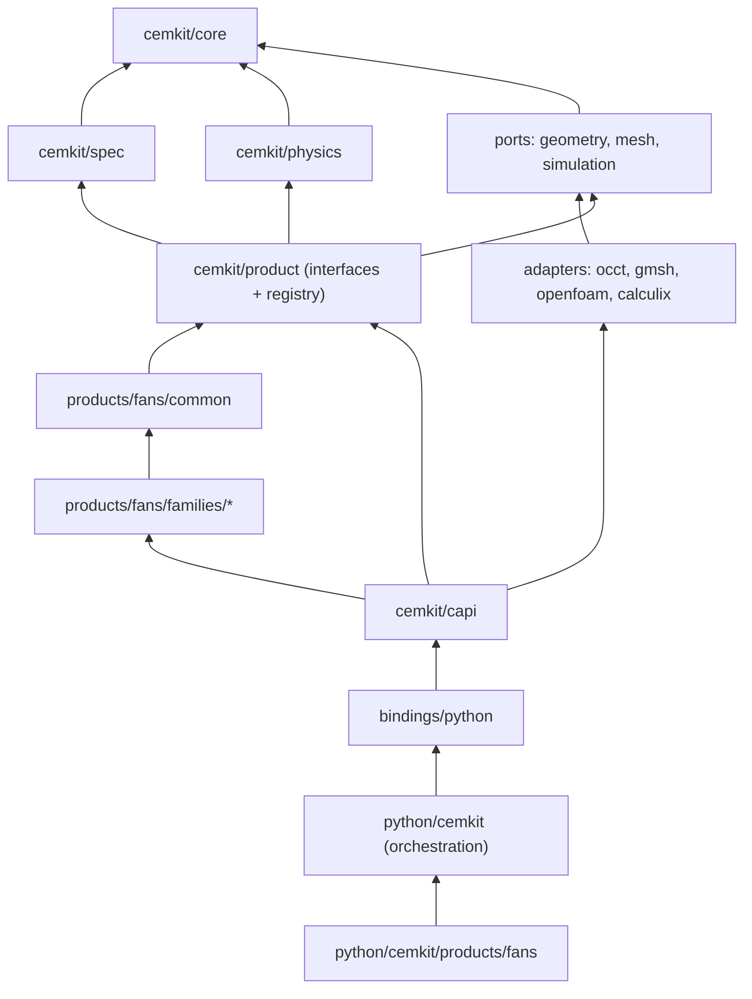

# CEM repository structure

Status: accepted as ADR-009. Supersedes the layout in requirements section 8 (spec v1.2).

Platform name: **cemkit** (C++ namespace `cemkit`, Python package `cemkit`). The bare name `cem` is taken on PyPI.

## 1. The one idea that makes it scale

The repository has a **product-agnostic CEM platform (`cemkit`)** and **product domains** that plug into it.
Fans are the first product. Pumps, heat exchangers or anything else later are new product folders;
the platform never changes to accommodate them.

Inside the platform, every external engine (geometry kernel, CFD solver, FEA solver, LLM provider,
database) sits behind an interface ("port") with one implementation per engine ("adapter").
Replacing or adding an engine means adding an adapter, not editing the code that uses it.

Three rules hold the structure together:

1. **Dependencies point inward.** Products depend on the platform; the platform never depends on a product.
   Adapters depend on their port; nothing else sees the engine behind it.
2. **Adding a feature means adding a folder.** If a new feature forces edits across unrelated modules,
   the boundary is wrong and needs an ADR before code.
3. **Modules talk through versioned contracts.** The C++/Python boundary and every stored record use
   the JSON schemas in `schemas/`, never internal object layouts.

## 2. Layout

```text
fan-cem/
├── CLAUDE.md  README.md  CMakeLists.txt  CMakePresets.json  vcpkg.json  pyproject.toml  uv.lock
├── .claude/                      Claude Code: hooks, agents, commands
├── .github/workflows/            CI
├── docker/                       Dockerfile (stages base, toolchain, ci, dev), pins.env
├── scripts/                      check.sh, dev.sh, versions.sh, generators (error codes, schemas)
│
├── docs/
│   ├── requirements.md  architecture.md  build-plan.md  toolchain.md  repository-structure.md
│   ├── adr/                      one file per decision, numbered, never deleted
│   ├── models/
│   │   ├── platform/             generic models: air properties, error codes, structures
│   │   └── fans/                 fan models: similarity, family selection, each family's L1 model
│   └── products/fans/            fan-specific guides, test-rig procedures, standards notes
│
├── schemas/                      versioned JSON contracts (single source for C++ and Python)
│   ├── cemkit/v1/                spec, candidate, result, error-codes, design-revision
│   └── products/fans/v1/         fan spec extensions, fan result metrics
│
├── data/                         sourced engineering data; every value carries a citation
│   ├── materials/                material properties (printed polymers, metals), with test basis
│   ├── airfoils/                 airfoil and cascade data, with Reynolds range
│   └── fans/                     family specific-speed ranges, loss correlations
│
├── kernel/                       C++23 kernel; every module is its own CMake target
│   ├── cmake/                    warnings, sanitizers, cemkit_add_module() helper
│   ├── cemkit/                   ── platform (product-agnostic) ──
│   │   ├── core/                 units, quantity (labelled value), fidelity, provenance, error, result, version
│   │   ├── spec/                 generic spec framework: fields, unit conversion, precedence, questions, versioning
│   │   ├── physics/              generic physics: gas properties, dimensional analysis, beam and centrifugal stress
│   │   ├── product/              Product and Family interfaces, registry, parameter spaces,
│   │   │                         constraint and objective interfaces
│   │   ├── geometry/
│   │   │   ├── port/             GeometryBackend interface, geometry checks, export interface
│   │   │   └── occt/             OpenCascade adapter (the only module that includes OCCT headers)
│   │   ├── mesh/
│   │   │   ├── port/             mesh-quality checks, mesher interface
│   │   │   └── gmsh/             Gmsh adapter (FEA meshes)
│   │   ├── simulation/
│   │   │   ├── port/             case-definition interfaces for CFD and FEA
│   │   │   ├── openfoam/         OpenFOAM case writer (templates + writer)
│   │   │   └── calculix/         CalculiX deck writer
│   │   └── capi/                 stable C ABI (cemkit.h); JSON in, JSON out
│   ├── products/                 ── product domains ──
│   │   └── fans/
│   │       ├── common/           fan-domain types and physics: fan total/static pressure kinds (ISO 5801),
│   │       │                     flow/pressure coefficients, specific speed and diameter, family selection
│   │       ├── register.cpp      register_fan_families(): calls each family's register function, in a fixed order
│   │       └── families/
│   │           ├── axial_ducted/ params, sizing, l1_model, constraints, geometry_recipe, cfd_case
│   │           ├── axial_free/   (v2)
│   │           ├── ceiling/      (v2–v3)
│   │           └── centrifugal/  (v3)
│   └── testing/                  stub_product/, stub_family/, compile_fail/, shared test helpers
│
├── bindings/python/              nanobind module cemkit._kernel: thin, batch-only, no logic
│
├── python/cemkit/                ── orchestration platform (product-agnostic) ──
│   ├── cli/                      Typer app; products register their own subcommands
│   ├── intake/
│   │   ├── port.py               vision/LLM provider interface
│   │   └── providers/            one module per provider
│   ├── orchestration/            job state machine, worker, resource limits, campaigns, reconciliation
│   ├── optimization/
│   │   ├── port.py               search-algorithm interface
│   │   ├── algorithms/           nsga2.py, ... (one file per algorithm)
│   │   └── promotion.py          L1 → L2 promotion, stopping rules
│   ├── simulation/
│   │   ├── runners/              openfoam.py, calculix.py (run external solvers under limits)
│   │   ├── trust_gate.py         simulation status per TRUST-004
│   │   └── mesh_study.py         GCI
│   ├── store/
│   │   ├── port.py               store interface
│   │   ├── sqlite/               SQLite backend + migrations
│   │   ├── artifacts.py          content-addressed artifact store, atomic publish
│   │   └── lineage.py            design revision chain (STORE-005)
│   ├── validation/               rig-data import, uncertainty, calibration vs holdout bookkeeping
│   ├── reporting/                report builder, sections/, templates/, banned-claims check
│   ├── reference/                Python reference implementations (tests only), mirroring kernel modules
│   └── products/fans/            fan-specific glue: CLI commands, report sections, rig data formats
│
├── tests/                        cross-module tests only (module tests live next to their module)
│   ├── integration/  e2e/  numerical/
│   └── hand_calcs/  proposed/  verified/
├── benchmarks/                   reference fans (measured data + provenance), CFD benchmark cases
├── examples/                     sample specs and images
└── spikes/                       throwaway exploration; never imported by production code
```

## 3. Dependency rules



Arrows point from a module to what it may use. Rules in words:

| Module | May depend on | Must never depend on |
| --- | --- | --- |
| `cemkit/core` | C++ standard library, mp-units | anything else |
| `cemkit/spec`, `cemkit/physics` | core | products, adapters |
| ports | core | adapters, products |
| adapters | their own port, their engine library | other adapters, products |
| `cemkit/product` | core, spec, physics, ports | adapters, any product |
| `products/fans/common` | platform modules above | families, other products |
| a family | `fans/common`, platform | other families |
| `capi` | everything in the kernel | bindings, Python |
| `python/cemkit` platform | the bindings, its own ports | `python/cemkit/products/*` |

**Registration is explicit, not static self-registration.** Self-registering objects in static
libraries are silently dropped by the linker when nothing references them, leaving an empty registry.
Instead:
- each family exposes one function, `register_family(Registry&)`;
- each product has one `register.cpp` that calls its families' functions in a fixed order (deterministic);
- the C ABI calls each product's registration function once at start-up.

Adding a family therefore means adding its folder plus one line in its product's `register.cpp`.
A CI test lists every folder under `products/*/families/` and fails if any is missing from the registry,
so a forgotten line can't go unnoticed. The stub family proves this end to end (FAM-002).
The platform still never names a product in its own code.

**Enforcement, not trust.** CI fails if a rule is broken:
- C++: each module is a CMake target with explicit links; a script checks the target link graph and
  each module's `#include` lines against the table above.
- Python: an import-boundary check (a small AST script, or a pinned import-linter if approved under LIFE-002).

### Includes and namespaces

- `kernel/` is the include root: `#include "cemkit/core/units.hpp"`, `#include "products/fans/common/pressure.hpp"`.
- Namespaces follow the path, with `products/` and `common/` dropped: `cemkit::core`, `cemkit::spec`,
  `cemkit::fans`, `cemkit::fans::axial_ducted`.
- Headers sit next to their sources. Headers in a module's `detail/` subfolder are private to that module;
  the include scan rejects them from anywhere else.
- Module tests live in the module (`<module>/tests/`) as their own test target, labelled by module in ctest.

## 4. Adding a feature: what you touch

| Future feature | You add | You don't touch |
| --- | --- | --- |
| New fan family (e.g. mixed-flow) | `kernel/products/fans/families/mixed_flow/`, its tests, `docs/models/fans/`, data with sources, one line in `products/fans/register.cpp` | platform, other families |
| New product (e.g. pumps) | `kernel/products/pumps/`, `python/cemkit/products/pumps/`, `schemas/products/pumps/` | platform, fans |
| New geometry engine (e.g. PicoGK) | `kernel/cemkit/geometry/picogk/` adapter | geometry users, products |
| New CFD solver (e.g. SU2) | `kernel/cemkit/simulation/su2/` writer + `python/cemkit/simulation/runners/su2.py` | optimization, products |
| New optimizer | `python/cemkit/optimization/algorithms/<name>.py` | campaigns, products |
| New LLM or vision provider | `python/cemkit/intake/providers/<name>.py` | spec compiler |
| ML surrogate models | `python/cemkit/surrogates/` implementing the evaluator interface, with its own fidelity label (append-only enum) | L2 verification path |
| PostgreSQL instead of SQLite | `python/cemkit/store/postgres/` backend | anything above the store port |
| New report format or section | `python/cemkit/reporting/sections/` or `templates/` | other reports |
| Web API or UI | new top-level `apps/api/`, `apps/web/` using `python/cemkit` as a library | `python/cemkit` itself (it never imports apps) |
| New material or airfoil data | files in `data/` with citations | code |

## 5. Versioning

- **Contracts:** schemas live under a version folder (`v1/`). Breaking changes create `v2/`; readers support both during migration.
- **Models and plugins:** each has a semantic version recorded in every result (PHY-004).
- **Codes and enums** (error codes, fidelity levels, statuses): append-only; never renamed, renumbered or reused.
- **Store:** forward-only migrations (STORE-004).
- **C ABI:** semantic versioning; an ABI version function (MAINT-005).

## 6. Things deliberately not done

- **No microservices** and no network between modules. One process plus solver subprocesses.
- **No runtime plugin loading** (shared libraries discovered at run time). Products and families are
  compiled in and registered explicitly (section 3). Revisit only when a third party needs to ship plugins.
- **No `utils` or `common` dumping ground** at platform level. Code that seems shared belongs to the
  module whose concept it is.
- **No product names in platform code.** If the platform needs to know about fans, an interface is missing.

## 7. Migrating from the current layout

Done as one structure-migration pull request before T04, with no new behaviour; it must stay green in CI.

1. ADR-009 accepts this structure. (The fallback wrapper type for pressure kinds, if ever needed, becomes ADR-010.)
2. Rename namespace `fancem` → `cemkit`, `libfancem` → per-module `cemkit_*` targets, `python/fancem` → `python/cemkit`.
3. Move the existing version code into an empty `kernel/cemkit/core` target.
4. Update every path that names the old layout: gcovr filters, clang-tidy `HeaderFilterRegex`, `scripts/check.sh`,
   the physics-reviewer agent, `CLAUDE.md`, `kernel/CLAUDE.md`, `python/CLAUDE.md`, `docs/build-plan.md`.
   The protected-file hook paths don't change.
5. Add the dependency-rule checks to `scripts/check.sh` (a script over `cmake --graphviz` output and `#include`
   lines; a small AST script for Python imports). No new dependencies.
6. Coverage scope (MAINT-003, spec v1.2): platform core, spec and physics, plus `products/*/common` and each
   family's L1 model.

T04 then writes directly into `kernel/cemkit/core/` and `kernel/products/fans/common/`.
